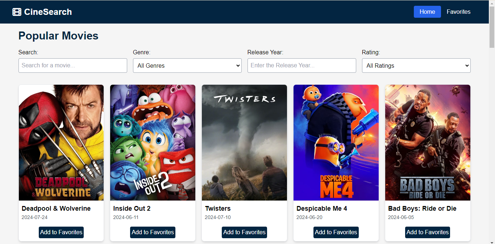
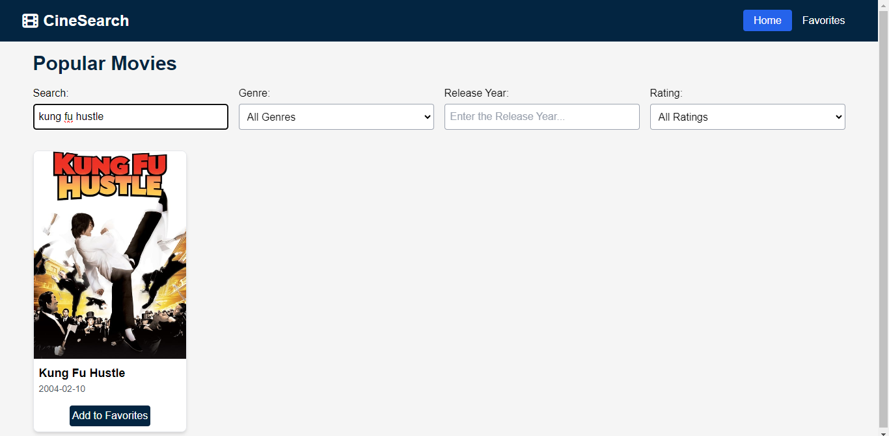
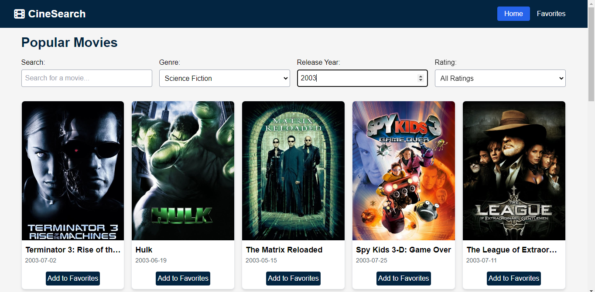

# CineSearch
## Description
CineSearch is a responsive movie browsing web application designed for movie enthusiasts, offering a seamless experience across all devices—whether desktop, tablet, or mobile. Built with React and powered by the TMDB API, CineSearch allows users to browse, search, and filter movies effortlessly without the need for logging in. Users can explore films based on their favorite genres, release years, and ratings, and even save their favorite movies to watch later.

Haina exciting [isn't that exiciting] 😍

## Features
- **Browse** Popular movies with title, poster and release year displayed.
- **Search** Movies by title with real-time changes
- **Infinite Scrolling** for uninterrupted movie browsing experience for the users
- **Advance filtering** options based on genre, release year and rating.
- **Save favorite movies**:- Save your favorite movies without signing up
- **Fully responsive design**:- Access it on any device

## Tech Stack
- **Frontend**: React for creating dynamic interactive components.
- **API**: TMDB API for fetching movie data such as title, poster image, and release year.
- **Styling**: Tailwind CSS for styling the React components.
- **Routing**: React Router for navigation between different pages.
- **Local Storage**: Used for storing favorite movies in the browser's local storage.

## Getting Started
### Prerequisites
- Node.js (v14 or higher)
- npm

### Installation
1. **Clone the repository:**
   ```bash
   git clone https://github.com/hiArpit/CineSearch.git

2. **Navigate to the project directory:**
    ```bash
    cd CineSearch

3. **Install the dependencies:**
    ```bash
    npm install

4. **Start the development server:**
    ```bash
    npm run dev

5. **Open the development server:**
Go to http://localhost:5173 to view the web application

## Deployment
The web application is deployed on Netlify. You can access the site as a user here: [CineSearch](https://main--cinesearchh.netlify.app/)
## Usage
- **Browse Movies**: View the list of popular movies on the homepage.
- **Search for Movies**: Use the search bar to find movies by title. The results will update dynamically as you type.
- **Load More Movies**: Scroll down to automatically load more movies thanks to infinite scrolling.
- **Filter Movies**: Refine your search by selecting genres, typing release years, or choosing ratings (7+, 8+, 9+).
- **Save Favorites**: Click the "Add to Favorites" button on a movie card to save it to your favorites list.

## Working of the Project

### Homepage


### Favorites Page


### Search Movies


### Select Genre


### Select Release Year


## Design Decisions
- **React** was chosen for its component-based architecture, allowing for the development of reusable UI components.
- **TMDB API** was selected for its comprehensive movie database and ease of use.
- **Tailwind CSS** was used for its utility-first approach to styling, which speeds up development and ensures a consistent design.
- **React Router** facilitates easy navigation between different sections of the application.
- **Local Storage** is utilized to store user preferences, such as favorite movies, directly in the browser.

## Possible Improvements
- **Implement User Authentication**: Allow users to create accounts and manage their favorite movies across sessions.
- **Add More Filters**: Expand filtering options to include additional criteria, such as actors or directors.
- **Movie Discussions**: Create a feature for users to discuss specific movies, sharing their thoughts and opinions.
- **Integrate Ratings**: Display ratings from IMDb, Rotten Tomatoes, or Metacritic for more comprehensive movie information.
- **Actor/Director Engagement**: Invite actors or directors for promotions or interviews to discuss their upcoming movies with viewers.

## Contribution
Want to contribute or want to share any feature. Your enthusiasm will meet with my pessimism. Jokes Jokes 😁. 
1. **Fork the repository**:- Click the "Fork" button at the top right of this repository page to create a copy under your own GitHub account.
2. **Create a new branch**:- Create a new branch for your feature or fix.
    ```bash
    git checkout -b {branch_name}
3. **Commit your changes:-**
    ```bash
    git commit -m "Description of changes"
4. **Push to your branch:-**
    ```bash
    git push origin {branch_name}
5. **Create a pull request:-** 
i)Open a pull request on GitHub from your branch to the main repository. 
ii) Open an issue to share any feature[🎁] or report bugs[😢]


## License
This project is licensed under the MIT License. See the [LICENSE](./LICENSE) file for details.

## Acknowledgments
- [TMDB API](https://www.themoviedb.org/documentation/api) for providing the movie data.
- [React](https://reactjs.org/) for the frontend framework.

## Contact
If you have any questions for me😎, feel free to reach out at [negiarpit2003@gmail.com](mailto:negiarpit2003@gmail.com).
